# ARC42 Architektur Dokumentation - Mac KI Service

## 1. Einführung und Ziele

### 1.1 Aufgabenstellung
Das Mac KI-Service System ist eine persönliche KI-basierte Multimedia-Generierungsplattform, die folgende Hauptfunktionen bietet:
- **Bildgenerierung** via DALL-E 3 (OpenAI API)
- **Musikgenerierung** via Mureka API
- **Asynchrone Verarbeitung** für zeitaufwendige Generierungsprozesse
- **Web-basierte Benutzeroberfläche** für einfache Bedienung

### 1.2 Qualitätsziele
| Priorität | Qualitätsziel      | Motivation                                              |
| --------- | ------------------ | ------------------------------------------------------- |
| 1         | **Verfügbarkeit**  | System muss 24/7 verfügbar sein für persönliche Nutzung |
| 2         | **Performance**    | Schnelle Response-Zeiten für API-Aufrufe                |
| 3         | **Skalierbarkeit** | Erweiterung um weitere KI-Services möglich              |
| 4         | **Wartbarkeit**    | Einfache Deployment und Updates                         |

### 1.3 Stakeholder
- **Rob (Entwickler/Nutzer)**: Einziger Nutzer und Entwickler des Systems

---

## 2. Randbedingungen

### 2.1 Technische Randbedingungen
- **Hardware**: Apple Silicon (M1 Max, M4) Architektur
- **Betriebssystem**: macOS
- **Containerisierung**: Docker (via colima)
- **Python Version**: Python 3 mit miniconda3
- **Entwicklungsumgebung**: PyCharm Pro (ARM64)

### 2.2 Organisatorische Randbedingungen
- Persönliches Projekt (keine Team-Entwicklung)
- Entwicklungs- und Produktionsumgebung getrennt
- .env-Dateien nicht in Git (API-Keys, Passwörter)

---

## 3. Kontextabgrenzung

### 3.1 Fachlicher Kontext

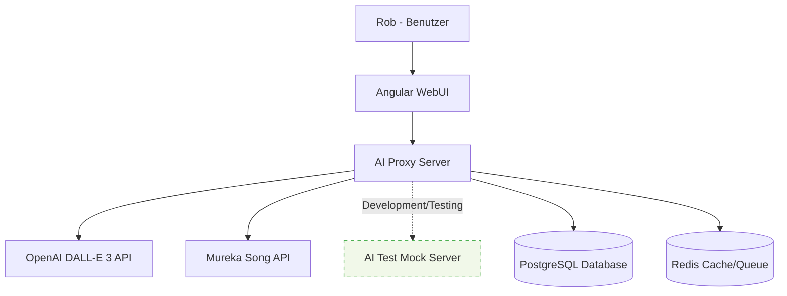

### 3.2 Technischer Kontext

**Externe Schnittstellen:**
- **OpenAI API**: DALL-E 3 für Bildgenerierung (HTTPS/REST)
- **Mureka API**: Musikgenerierung (HTTPS/REST)
- **AI Test Mock**: Mock-Server für Development/Testing (HTTP/REST) - Kostensenkung

**Interne Schnittstellen:**
- **Frontend ↔ Backend**: REST API (JSON über HTTPS)
- **Backend ↔ Database**: PostgreSQL (SQL)
- **Backend ↔ Cache**: Redis (Key-Value)

---

## 4. Lösungsstrategie

### 4.1 Architekturansatz
- **Microservice-orientiert**: Getrennte Services für verschiedene Funktionen
- **Event-driven**: Asynchrone Verarbeitung via Celery
- **API-First**: REST API als zentrale Schnittstelle
- **Containerisiert**: Docker für konsistente Deployments

### 4.2 Technologie-Stack
- **Frontend**: Angular 17 + TypeScript + Angular Material
- **Backend**: Python Flask + SQLAlchemy + Alembic
- **Async Processing**: Celery + Redis
- **Database**: PostgreSQL 15
- **Proxy**: Nginx (Produktion)
- **Container**: Docker + Docker Compose

---

## 5. Bausteinsicht

### 5.1 Systemübersicht

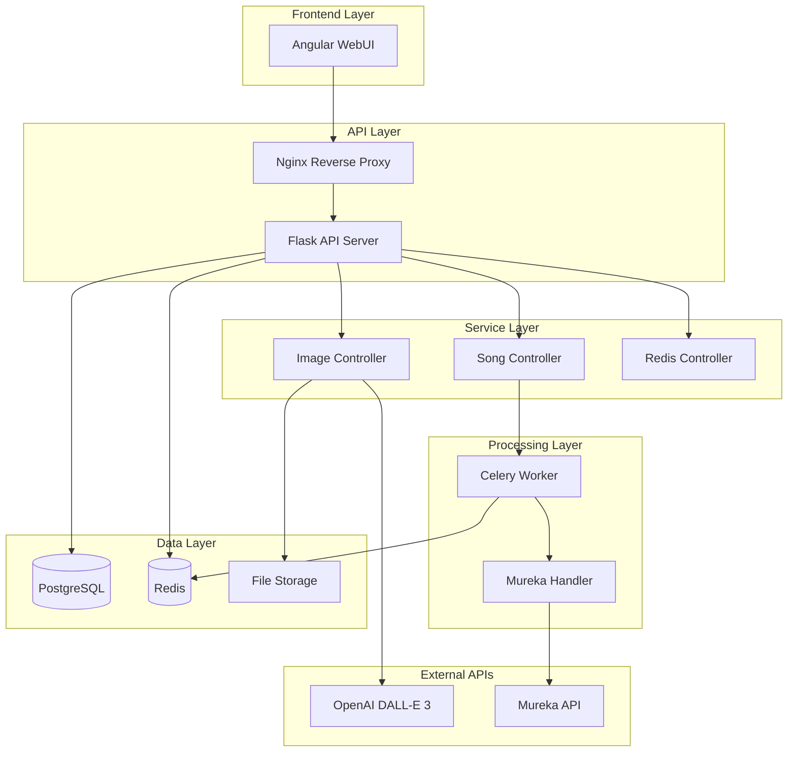

### 5.2 Komponenten-Details

#### 5.2.1 aiwebui (Frontend)
- **Technologie**: Angular 17 + TypeScript
- **Komponenten**:
  - `image-generator`: UI für Bildgenerierung
  - `image-view`: Anzeige generierter Bilder
  - `song-generator`: UI für Musikgenerierung
  - `song-view`: Anzeige generierter Songs
  - `song-profil`: Mureka Account-Informationen
- **Services**: API-Integration, Konfiguration
- **Build**: `npm run build:prod` → Deployment nach `revproxy/html`

#### 5.2.2 aiproxysrv (Backend API)
- **Technologie**: Python Flask + SQLAlchemy
- **Struktur**:
  ```
  src/
  ├── api/           # Controllers & Routes
  ├── db/            # Models & Database
  ├── celery_app/    # Async Processing
  ├── config/        # Konfiguration
  ├── mureka/        # Mureka Integration
  └── alembic/       # DB Migrations
  ```

#### 5.2.3 aitestmock (Test Mock Server)
- **Technologie**: Python Flask
- **Zweck**: Mock-Server für OpenAI und Mureka APIs zur Kostensenkung in Entwicklung/Testing
- **Struktur**:
  ```
  src/           # Source Code
  data/          # JSON Response Templates
  static/        # Mock Images, Audio Files (FLAC/MP3/ZIP)
  ```
- **Test-Szenarien**:
  - **Bildgenerierung**: Prompt mit "0001" → Success, "0002" → Invalid Token Error
  - **Song-Generierung**: Lyrics mit "0001" → Success, "0002" → Invalid Token, "0003" → Generation Failed
  - **Timing**: Style-Prompt "30s" → 30 Sekunden Sync Duration

#### 5.2.4 revproxy (Nginx)
- **Technologie**: Nginx 1.23.3
- **Funktionen**:
  - HTTPS Terminierung (TLS 1.3)
  - Rate Limiting (5req/s)
  - Static File Serving
  - API Proxy zu aiproxysrv:5050

---

## 6. Laufzeitsicht

### 6.1 Bildgenerierung (Synchron)

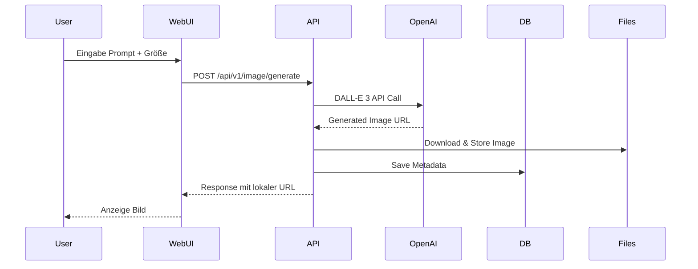

### 6.2 Musikgenerierung (Asynchron)

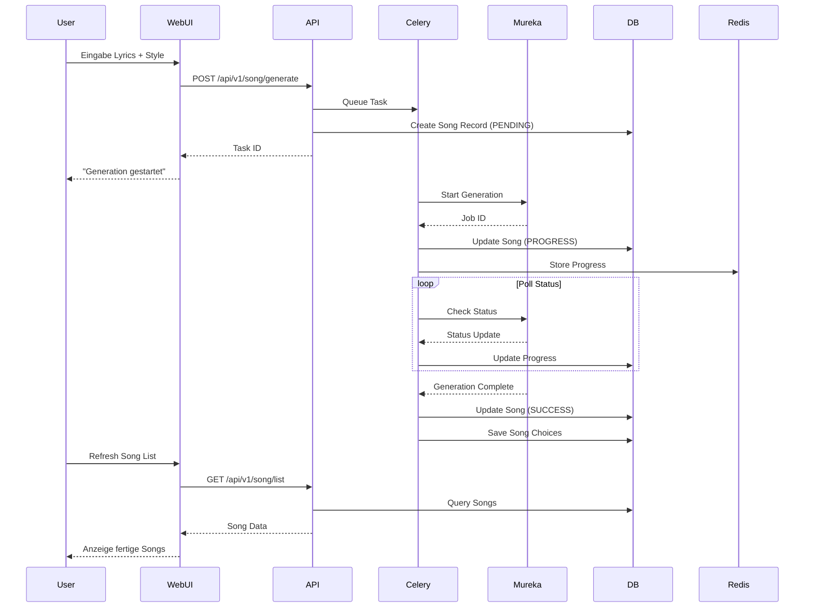

---

## 7. Verteilungssicht

### 7.1 Entwicklungsumgebung
```
MacBook Air M4 (32GB RAM)
├── Host macOS
├── PyCharm Pro (ARM64)
├── Python miniconda3 (mac_ki_service env)
├── Docker colima
│   └── PostgreSQL Container (Port 5432)
├── Local Services
│   ├── Flask Dev Server (server.py)
│   ├── Celery Worker (worker.py)
│   ├── Angular Dev Server (ng serve)
│   └── AI Test Mock Server (aitestmock) - Optional für Kostensenkung
└── Configuration
    └── .env Dateien mit Mock-API URLs statt echter OpenAI/Mureka APIs
```

### 7.2 Produktionsumgebung
```
Mac Studio M1 Max (32GB RAM) - IP: 10.0.1.120
├── Host macOS
├── Docker colima
│   ├── webui-network (Bridge)
│   ├── PostgreSQL (Container: postgres)
│   ├── Redis (Container: redis)
│   ├── Celery Worker (Container: celery-worker)
│   ├── API Server (Container: aiproxysrv)
│   └── Nginx Proxy (Container: forward-proxy)
├── Native Services
│   ├── Ollama (Port 11434)
│   └── Open WebUI
└── Storage
    ├── postgres-data (Volume)
    ├── redis-data (Volume)
    └── images-data (Volume)
```

### 7.3 Netzwerk-Architektur

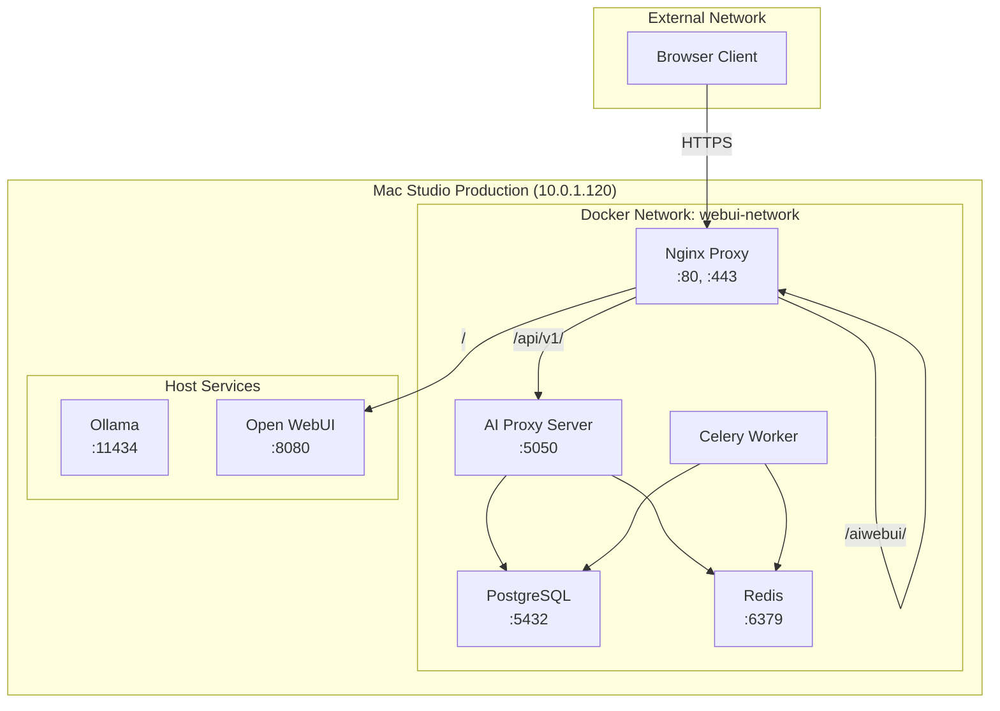

---

## 8. API Dokumentation

### 8.1 Basis-Konfiguration
- **Base URL**: `https://macstudio/api/v1` (Produktion)
- **Base URL**: `http://localhost:5050/api/v1` (Entwicklung)
- **Content-Type**: `application/json`
- **CORS**: Alle Origins erlaubt (`*`)

### 8.2 Image API (`/api/v1/image`)

#### 8.2.1 Bildgenerierung
```http
POST /api/v1/image/generate
Content-Type: application/json

{
    "prompt": "A beautiful sunset over mountains",
    "size": "1024x1024"
}
```

**Response:**
```json
{
    "id": "550e8400-e29b-41d4-a716-446655440000",
    "prompt": "A beautiful sunset over mountains",
    "size": "1024x1024",
    "filename": "img_20241201_142530_abc123.png",
    "local_url": "https://macstudio/api/v1/image/img_20241201_142530_abc123.png",
    "created_at": "2024-12-01T14:25:30Z"
}
```

#### 8.2.2 Bildliste abrufen
```http
GET /api/v1/image/list?limit=20&offset=0
```

**Response:**
```json
{
    "images": [
        {
            "id": "550e8400-e29b-41d4-a716-446655440000",
            "prompt": "A beautiful sunset over mountains",
            "filename": "img_20241201_142530_abc123.png",
            "local_url": "https://macstudio/api/v1/image/img_20241201_142530_abc123.png",
            "created_at": "2024-12-01T14:25:30Z"
        }
    ],
    "total": 1,
    "limit": 20,
    "offset": 0
}
```

#### 8.2.3 Einzelnes Bild abrufen
```http
GET /api/v1/image/{image_id}
```

#### 8.2.4 Bild-Datei ausliefern
```http
GET /api/v1/image/{filename}
```

### 8.3 Song API (`/api/v1/song`)

#### 8.3.1 Song-Generierung starten
```http
POST /api/v1/song/generate
Content-Type: application/json

{
    "lyrics": "Verse 1:\nIn the morning light...",
    "prompt": "acoustic folk, gentle melody",
    "model": "chirp-v3-5"
}
```

**Response:**
```json
{
    "task_id": "abc123-def456-ghi789",
    "song_id": "550e8400-e29b-41d4-a716-446655440001",
    "status": "PENDING",
    "message": "Song generation started"
}
```

#### 8.3.2 Mureka Account Info
```http
GET /api/v1/song/mureka-account
```

**Response:**
```json
{
    "account": {
        "user_id": "user_123",
        "credits_remaining": 95,
        "subscription_type": "pro"
    }
}
```

#### 8.3.3 Song-Information abrufen
```http
GET /api/v1/song/query/{job_id}
```

### 8.4 Task Management API (`/api/v1/song/task`)

#### 8.4.1 Task-Status prüfen
```http
GET /api/v1/song/task/status/{task_id}
```

**Response:**
```json
{
    "task_id": "abc123-def456-ghi789",
    "status": "SUCCESS",
    "song": {
        "id": "550e8400-e29b-41d4-a716-446655440001",
        "lyrics": "Verse 1:\nIn the morning light...",
        "prompt": "acoustic folk, gentle melody",
        "status": "SUCCESS",
        "choices": [
            {
                "id": "choice_001",
                "mp3_url": "https://mureka.com/song_001.mp3",
                "duration": 180000,
                "title": "Morning Light",
                "tags": "acoustic, folk, gentle"
            }
        ],
        "created_at": "2024-12-01T15:30:00Z",
        "completed_at": "2024-12-01T15:35:00Z"
    }
}
```

#### 8.4.2 Task abbrechen
```http
POST /api/v1/song/task/cancel/{task_id}
```

#### 8.4.3 Task löschen
```http
DELETE /api/v1/song/task/delete/{task_id}
```

#### 8.4.4 Queue-Status
```http
GET /api/v1/song/task/queue-status
```

**Response:**
```json
{
    "active_tasks": 1,
    "pending_tasks": 0,
    "completed_tasks": 5,
    "failed_tasks": 0,
    "worker_status": "online"
}
```

### 8.5 Redis Management API (`/api/v1/redis`)

#### 8.5.1 Alle Celery Tasks auflisten
```http
GET /api/v1/redis/list
```

#### 8.5.2 Redis Keys auflisten
```http
GET /api/v1/redis/list/keys
```

#### 8.5.3 Redis Key löschen
```http
DELETE /api/v1/redis/{task_id}
```

### 8.6 AI Test Mock API (`aitestmock` - Development/Testing)

#### 8.6.1 Mock Server Configuration
```http
Base URL: http://localhost:8000 (Development)
Content-Type: application/json
```

**Zweck**: Ersetzt OpenAI und Mureka APIs in der Entwicklung um Kosten zu sparen

#### 8.6.2 Mock Image Generation
```http
POST /v1/images/generations
Content-Type: application/json

{
    "prompt": "A test image 0001",
    "size": "1024x1024"
}
```

**Test-Szenarien:**
- Prompt enthält `"0001"` → 200 OK mit Mock-Bild
- Prompt enthält `"0002"` → 401 Invalid Bearer Token Error

**Response:**
```json
{
    "created": 1234567890,
    "data": [
        {
            "url": "http://localhost:8000/static/images/test_image_0001.png"
        }
    ]
}
```

#### 8.6.3 Mock Song Generation
```http
POST /generate
Content-Type: application/json

{
    "lyrics": "Test lyrics 0001",
    "prompt": "acoustic folk 30s",
    "model": "chirp-v3-5"
}
```

**Test-Szenarien:**
- Lyrics enthalten `"0001"` → 200 OK
- Lyrics enthalten `"0002"` → 401 Invalid Bearer Token
- Lyrics enthalten `"0003"` → 500 Song Generation Failed
- Style-Prompt `"30s"` → 30 Sekunden Sync Duration

**Response:**
```json
{
    "id": "mock_job_12345",
    "status": "queued"
}
```

#### 8.6.4 Mock Song Status Query
```http
GET /query/{job_id}
```

**Response:**
```json
{
    "id": "mock_job_12345",
    "status": "complete",
    "choices": [
        {
            "id": "choice_001",
            "song_name": "Test Song",
            "audio_url": "http://localhost:8000/static/audio/test_song.mp3",
            "duration": 30000,
            "tags": "acoustic, folk, test"
        }
    ]
}
```

---

## 9. Deployment-Grafik

### 9.1 Entwicklungs-Deployment

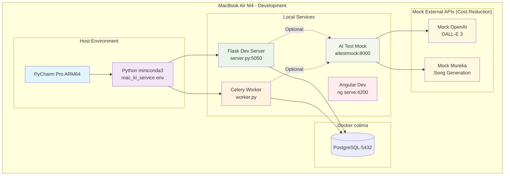

### 9.2 Produktions-Deployment

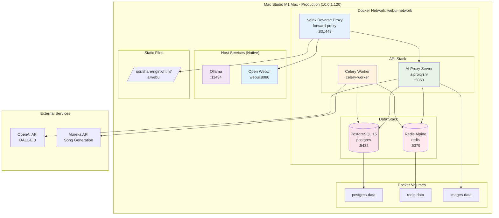

### 9.3 Container-Orchestrierung

```yaml
# Vereinfachte docker-compose.yml Struktur
services:
  postgres:
    image: postgres:15-alpine
    ports: ["5432:5432"]
    volumes: [postgres-data:/var/lib/postgresql/data]
    healthcheck: pg_isready

  redis:
    image: redis:alpine  
    ports: ["6379:6379"]
    volumes: [redis-data:/data]
    healthcheck: redis-cli ping

  celery-worker:
    build: .
    command: celery worker
    depends_on: [postgres, redis]
    volumes: [.:/app]

  aiproxy-app:
    build: .
    ports: ["5050:5050"] 
    depends_on: [postgres, celery-worker]
    volumes: [.:/app, images-data:/images]

  nginx:
    image: nginx:1.23.3
    ports: ["80:80", "443:443"]
    volumes: [./nginx/nginx.conf:/etc/nginx/nginx.conf]
```

---

## 10. Wichtigste Prozesse

### 10.1 Song-Generierung Workflow

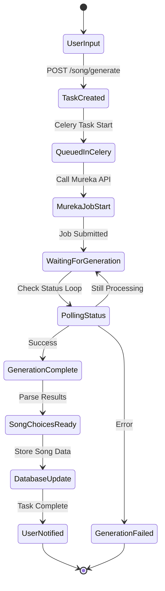

### 10.2 Error Handling & Retry Logic

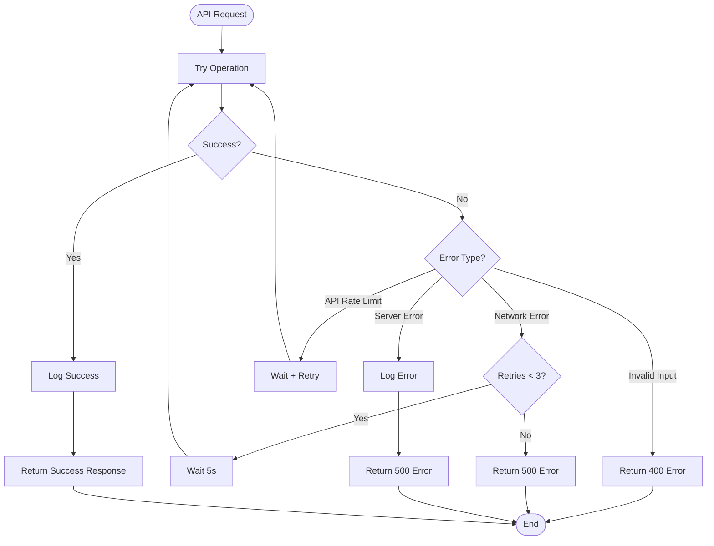

### 10.3 Health Check Prozess

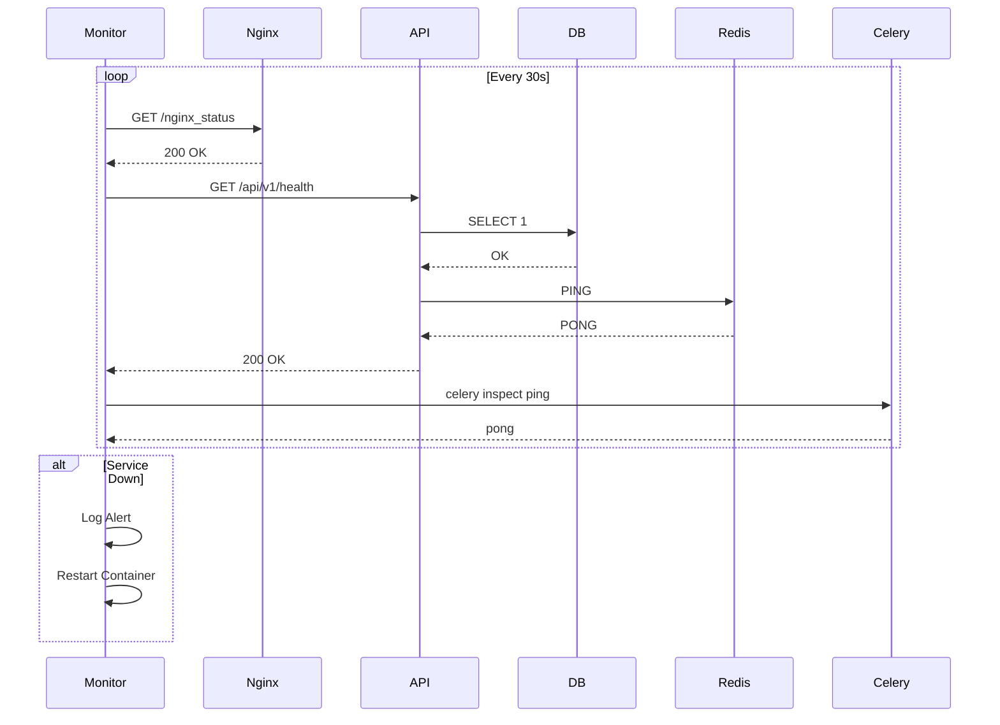

### 10.4 Backup & Recovery Prozess

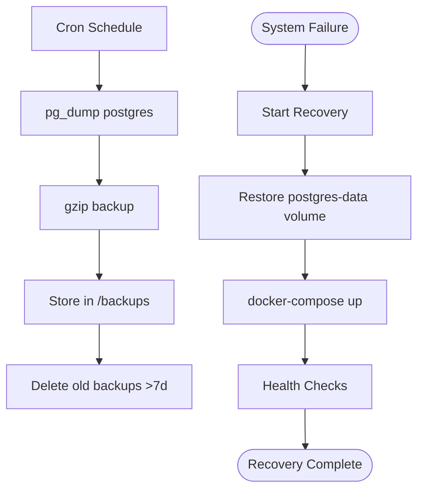

---

## 11. Qualitätsanforderungen

### 11.1 Performance
- **API Response Time**: < 200ms für Standard-Requests
- **Image Generation**: < 30s für DALL-E 3 Calls
- **Song Generation**: 2-5 Minuten (abhängig von Mureka)
- **Concurrent Users**: 1 (persönliche Nutzung)

### 11.2 Security
- **HTTPS**: TLS 1.3 Verschlüsselung
- **Rate Limiting**: 5 req/s via Nginx
- **API Keys**: Secure Storage in .env files
- **CORS**: Konfiguriert für Frontend-Domain

### 11.3 Monitoring
- **Health Checks**: Alle Services alle 30s
- **Logging**: Strukturierte Logs via Python logging
- **Alerts**: Container-Restart bei Health Check Failures

---

## 12. Glossar

| Begriff        | Definition                                                                      |
| -------------- | ------------------------------------------------------------------------------- |
| **DALL-E 3**   | OpenAI's Bildgenerierungs-KI                                                    |
| **Mureka**     | Song-Generierungs-API Service                                                   |
| **Celery**     | Python Task Queue für asynchrone Verarbeitung                                   |
| **Colima**     | Container Runtime für macOS (Docker Alternative)                                |
| **Alembic**    | Database Migration Tool für SQLAlchemy                                          |
| **Task ID**    | Celery Task Identifier für Async Operations                                     |
| **Job ID**     | Mureka Job Identifier für Song Generation                                       |
| **Choice**     | Einzelne Musikvariante von Mureka (meist 2 pro Generation)                      |
| **aitestmock** | Mock-Server für OpenAI und Mureka APIs zur Kostensenkung in Development/Testing |

---

*Dokument erstellt am: 2024-12-12*  
*Version: 1.0*  
*Autor: Rob (via Claude)*