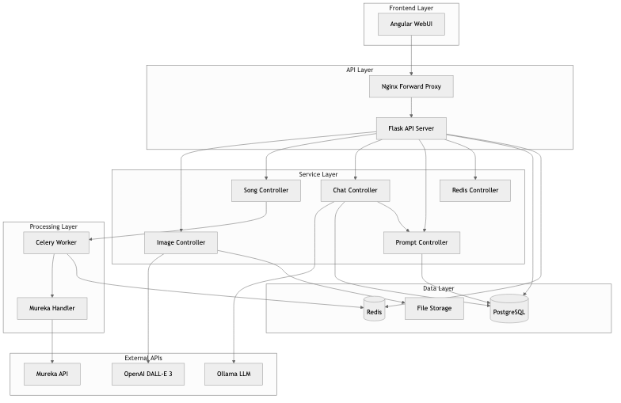
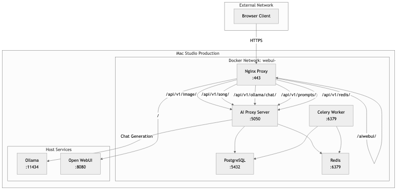
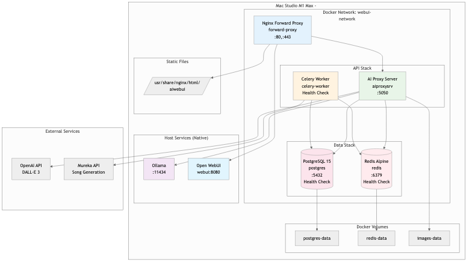

# ARC42 Architecture Documentation - Mac AI Service

## Table of Contents

1. [Introduction and Goals](#1-introduction-and-goals)
   - [1.1 Requirements Overview](#11-requirements-overview)
   - [1.2 Quality Goals](#12-quality-goals)
   - [1.3 Stakeholders](#13-stakeholders)
2. [Constraints](#2-constraints)
   - [2.1 Technical Constraints](#21-technical-constraints)
   - [2.2 Organizational Constraints](#22-organizational-constraints)
3. [Context Boundary](#3-context-boundary)
   - [3.1 Business Context](#31-business-context)
   - [3.2 Technical Context](#32-technical-context)
4. [Solution Strategy](#4-solution-strategy)
   - [4.1 Architecture Approach](#41-architecture-approach)
   - [4.2 Technology Stack](#42-technology-stack)
5. [Building Block View](#5-building-block-view)
   - [5.1 System Overview](#51-system-overview)
   - [5.2 Component Details](#52-component-details)
6. [Runtime View](#6-runtime-view)
   - [6.1 Image Generation (Synchronous)](#61-image-generation-synchronous)
   - [6.2 Music Generation (Asynchronous)](#62-music-generation-asynchronous)
7. [Deployment View](#7-deployment-view)
   - [7.1 Development Environment](#71-development-environment)
   - [7.2 Production Environment](#72-production-environment)
   - [7.3 Network Architecture](#73-network-architecture)
8. [API Documentation](#8-api-documentation)
9. [Deployment Diagrams](#9-deployment-diagrams)
   - [9.1 Development Deployment](#91-development-deployment)
   - [9.2 Production Deployment](#92-production-deployment)
   - [9.3 Container Orchestration](#93-container-orchestration)
10. [Key Processes](#10-key-processes)
    - [10.1 Song Generation Workflow](#101-song-generation-workflow)
    - [10.2 Error Handling & Retry Logic](#102-error-handling--retry-logic)
    - [10.3 Health Check Process](#103-health-check-process)
    - [10.4 Backup & Recovery Process](#104-backup--recovery-process)
11. [Quality Requirements](#11-quality-requirements)
    - [11.1 Performance](#111-performance)
    - [11.2 Security](#112-security)
    - [11.3 Monitoring](#113-monitoring)
12. [Glossary](#12-glossary)
13. [Database Schema](#13-database-schema)
    - [13.1 Entity-Relationship Diagram](#131-entity-relationship-diagram)
    - [13.2 Table Overview](#132-table-overview)
    - [13.3 Relationships and Constraints](#133-relationships-and-constraints)
    - [13.4 Migration and Maintenance](#134-migration-and-maintenance)

## Figure Index

- [Figure 3.1: Business Context](#31-business-context) - `images/3.1_fachlicher_kontext.png`
- [Figure 5.1: System Overview](#51-system-overview) - `images/5.1_systemuebersicht.png`
- [Figure 5.2.1: Angular Project Structure](#521-aiwebui-frontend) - `images/5.2.1_angular_projektstruktur.png`
- [Figure 6.1: Image Generation (Synchronous)](#61-image-generation-synchronous) - `images/6.1_bildgenerierung.png`
- [Figure 6.2: Music Generation (Asynchronous)](#62-music-generation-asynchronous) - `images/6.2_musikgenerierung.png`
- [Figure 7.3: Network Architecture](#73-network-architecture) - `images/7.3_netzwerk_architektur.png`
- [Figure 9.1: Development Deployment](#91-development-deployment) - `images/9.1_entwicklungs_deployment.png`
- [Figure 9.2: Production Deployment](#92-production-deployment) - `images/9.2_produktions_deployment.png`
- [Figure 10.1: Song Generation Workflow](#101-song-generation-workflow) - `images/10.1_song_generierung_workflow.png`
- [Figure 10.2: Error Handling & Retry Logic](#102-error-handling--retry-logic) - `images/10.2_error_handling.png`
- [Figure 10.3: Health Check Process](#103-health-check-process) - `images/10.3_health_check.png`
- [Figure 10.4: Backup & Recovery Process](#104-backup--recovery-process) - `images/10.4_backup_recovery.png`
- [Figure 13.1: Database Schema](#131-entity-relationship-diagram) - `images/13_database_schema.png`

---

## 1. Introduction and Goals

### 1.1 Requirements Overview
The Mac AI Service System is a personal AI-based multimedia generation platform offering the following main features:
- **Image Generation** via DALL-E 3 (OpenAI API)
- **Music Generation** via Mureka API
- **Asynchronous Processing** for time-intensive generation processes
- **Ollama Model Chat** for prompt improvements via prompt templates
- **Web-based User Interface** for easy operation

### 1.2 Quality Goals
| Priority | Quality Goal       | Motivation                                             |
| -------- | ------------------ | ------------------------------------------------------ |
| 1        | **Availability**   | System must be available 24/7 for personal use         |
| 2        | **Performance**    | Fast response times for API calls                      |
| 3        | **Scalability**    | Extension with additional AI services possible         |
| 4        | **Maintainability**| Easy deployment and updates                            |

### 1.3 Stakeholders
- **Robert Wellinger (Developer/User)**: Currently the only user and developer of the system

---

## 2. Constraints

### 2.1 Technical Constraints
- **Hardware**: Apple Silicon (M1 Max, M4) architecture
- **Operating System**: macOS
- **Containerization**: Docker (via colima)
- **Python Version**: Python 3 with miniconda3
- **Development Environment**: PyCharm Pro (ARM64)

### 2.2 Organizational Constraints
- Personal project (no team development)
- Development and production environments separated
- .env files not in Git (API keys, passwords)

---

## 3. Context Boundary

### 3.1 Business Context


*Figure 3.1: Business Context - Overview of the main actors and systems*

### 3.2 Technical Context

**External Interfaces:**
- **OpenAI API**: DALL-E 3 for image generation (HTTPS/REST)
- **Mureka API**: Music generation (HTTPS/REST)
- **AI Test Mock**: Mock server for development/testing (HTTP/REST) - Cost reduction

**Internal Interfaces:**
- **Frontend ↔ Backend**: REST API (JSON over HTTPS)
- **Backend ↔ Database**: PostgreSQL (SQL)
- **Backend ↔ Cache**: Redis (Key-Value)
- **Ollama LLM**: Various AI model chats (HTTPS/REST)

---

## 4. Solution Strategy

### 4.1 Architecture Approach
- **Microservice-oriented**: Separate services for different functions
- **Event-driven**: Asynchronous processing via Celery
- **API-First**: REST API as central interface
- **Containerized**: Docker for consistent deployments

### 4.2 Technology Stack
- **Frontend**: Angular 18.2.13 + TypeScript + Angular Material + SCSS + RxJS
- **Backend**: Python Flask 3.1.2 + SQLAlchemy 2.0 + Pydantic 2.0 + Alembic 1.13
- **API Documentation**: Flask-APISpec + OpenAPI/Swagger
- **Authentication**: Flask-CORS + PyJWT + BCrypt
- **Async Processing**: Celery 5.4 + Redis 5.0
- **Database**: PostgreSQL 15 + psycopg2-binary
- **Web Server**: Gunicorn (Production), Flask Dev Server (Development)
- **Proxy**: Nginx 1.23.3 (Production)
- **Container**: Docker + Docker Compose (Colima on macOS)

---

## 5. Building Block View

### 5.1 System Overview



*Figure 5.1: System Overview - Architectural layers and components*

### 5.2 Component Details

#### 5.2.1 aiwebui (Frontend)


*Figure 5.2.1: Angular Project Structure - Components, services and modules of the frontend*

- **Technology**: Angular 18.2.13 + TypeScript + SCSS + Angular Material
- **Structure**:
  ```
  src/app/
  ├── components/    # Shared Components
  ├── pages/         # Feature Pages
  │   ├── image-generator/    # UI for image generation
  │   ├── image-view/         # Display of generated images
  │   ├── song-generator/     # UI for music generation
  │   ├── song-view/          # Display of generated songs
  │   ├── song-profile/       # Mureka account information
  │   ├── user-profile/       # User profile page
  │   └── prompt-templates/   # Template management for prompts
  ├── services/      # API Services & Business Logic
  ├── models/        # TypeScript Interfaces & Models
  ├── pipes/         # Custom Angular Pipes
  ├── guards/        # Route Guards
  ├── interceptors/  # HTTP Interceptors
  └── auth/          # Authentication Logic
  ```
- **Services**: API integration, configuration, prompt management, notifications
- **Shared Components**: Header, footer, detail panels, audio player, progress overlay
- **Dependencies**: Angular Material, RxJS, ngx-cookie-service, compromise
- **Build**: `npm run build:prod` → Deployment to `forwardproxy/html/aiwebui`

#### 5.2.2 aiproxysrv (Backend API)
- **Technology**: Python Flask + SQLAlchemy + Pydantic
- **Struktur**:
  ```
  src/
  ├── api/           # API Layer (Business Logic & Routing)
  ├── business/      # Core Business Logic Services
  ├── db/            # Models & Database Connection
  ├── schemas/       # Pydantic Data Schemas
  ├── celery_app/    # Async Processing (Mureka API)
  ├── config/        # Configuration (reads .env)
  ├── utils/         # Utility Functions
  ├── mureka/        # Mureka Integration Functions
  ├── alembic/       # DB Migrations
  ├── server.py      # Dev Server (PyCharm)
  ├── wsgi.py        # Prod Entry (Gunicorn)
  └── worker.py      # Celery Worker
  ```

#### 5.2.3 aitestmock (Test Mock Server)
- **Technology**: Python Flask
- **Purpose**: Mock server for OpenAI and Mureka APIs to reduce costs in development/testing
- **Structure**:
  ```
  src/           # Source Code
  data/          # JSON Response Templates
  static/        # Mock Images, Audio Files (FLAC/MP3/ZIP)
  ```
- **Test Scenarios**:
  - **Image Generation**: Prompt with "0001" → Success, "0002" → Invalid Token Error
  - **Song Generation**: Lyrics with "0001" → Success, "0002" → Invalid Token, "0003" → Generation Failed
  - **Timing**: Style-Prompt "30s" → 30 seconds sync duration

#### 5.2.4 forwardproxy (Nginx)
- **Technology**: Nginx 1.23.3
- **Functions**:
  - HTTPS termination (TLS 1.3)
  - Rate limiting (5req/s)
  - Static file serving
  - API proxy to aiproxysrv:5050

---

## 6. Runtime View

### 6.1 Image Generation (Synchronous)


*Figure 6.1: Image Generation (Synchronous) - Sequence diagram of the image generation process*

### 6.2 Music Generation (Asynchronous)


*Figure 6.2: Music Generation (Asynchronous) - Sequence diagram of the asynchronous music generation process*

---

## 7. Deployment View

### 7.1 Development Environment
```
MacBook Air M4 (32GB RAM)
├── Host macOS
├── PyCharm Pro (ARM64)
├── Python miniconda3 (mac_ki_service env)
├── Docker colima
│   └── PostgreSQL Container (Port 5432)
├── Local Services
│   ├── Flask Dev Server (src/server.py)
│   ├── Celery Worker (src/worker.py)
│   ├── Angular Dev Server (ng serve)
│   └── AI Test Mock Server (aitestmock) - Optional for cost reduction
└── Configuration
    └── .env files with Mock-API URLs instead of real OpenAI/Mureka APIs
```

### 7.2 Production Environment
```
Mac Studio M1 Max (32GB RAM) - IP: 10.0.1.120
├── Host macOS
├── Docker colima
│   ├── webui-network (Bridge)
│   ├── PostgreSQL (Container: postgres)
│   ├── Redis (Container: redis)
│   ├── Celery Worker (Container: celery-worker)
│   ├── API Server (Container: aiproxysrv)
│   └── Nginx Proxy (Container: forward-proxy)
├── Native Services
│   ├── Ollama (Port 11434)
│   └── Open WebUI
└── Storage
    ├── postgres-data (Volume)
    ├── redis-data (Volume)
    └── images-data (Volume)
```

### 7.3 Network Architecture



*Figure 7.3: Network Architecture - Production environment with Docker network and host services*

---

## 8. API Documentation

The complete API documentation is automatically generated and always available up-to-date:

- **Swagger UI**: `http://localhost:5050/api/docs/` (interactive documentation)
- **OpenAPI JSON**: `http://localhost:5050/api/openapi.json`
- **OpenAPI YAML**: `http://localhost:5050/api/openapi.yaml`

The documentation is automatically generated from the Python code (code-first approach) and is therefore always in sync with the implementation.

---

## 9. Deployment Diagrams

### 9.1 Development Deployment


*Figure 9.1: Development Deployment - Local development environment with mock services*

### 9.2 Production Deployment



*Figure 9.2: Production Deployment - Complete Docker-based production environment*

### 9.3 Container Orchestration

```yaml
# Simplified docker-compose.yml structure
services:
  postgres:
    image: postgres:15-alpine
    ports: ["5432:5432"]
    volumes: [postgres-data:/var/lib/postgresql/data]
    healthcheck: pg_isready

  redis:
    image: redis:alpine  
    ports: ["6379:6379"]
    volumes: [redis-data:/data]
    healthcheck: redis-cli ping

  celery-worker:
    build: .
    command: celery worker
    depends_on: [postgres, redis]
    volumes: [.:/app]

  aiproxy-app:
    build: .
    ports: ["5050:5050"] 
    depends_on: [postgres, celery-worker]
    volumes: [.:/app, images-data:/images]

  nginx:
    image: nginx:1.23.3
    ports: ["80:80", "443:443"]
    volumes: [./nginx/nginx.conf:/etc/nginx/nginx.conf]
```

---

## 10. Key Processes

### 10.1 Song Generation Workflow


*Figure 10.1: Song Generation Workflow - State diagram of the complete song generation process*

### 10.2 Error Handling & Retry Logic


*Figure 10.2: Error Handling & Retry Logic - Flow diagram of error handling and retry mechanisms*

### 10.3 Health Check Process


*Figure 10.3: Health Check Process - Monitoring and supervision of all services*

### 10.4 Backup & Recovery Process


*Figure 10.4: Backup & Recovery Process - Data backup and restoration*

---

## 11. Quality Requirements

### 11.1 Performance
- **API Response Time**: < 200ms for standard requests
- **Image Generation**: < 30s for DALL-E 3 calls
- **Song Generation**: 2-5 minutes (depending on Mureka)
- **Concurrent Users**: 1 (personal use)

### 11.2 Security
- **HTTPS**: TLS 1.3 encryption
- **Rate Limiting**: 5 req/s via Nginx
- **API Keys**: Secure storage in .env files
- **CORS**: Configured for frontend domain

### 11.3 Monitoring
- **Health Checks**: All services every 30s
- **Logging**: Structured logs via Python logging
- **Alerts**: Container restart on health check failures

---

## 12. Glossary

| Term           | Definition                                                                      |
| -------------- | ------------------------------------------------------------------------------- |
| **DALL-E 3**   | OpenAI's image generation AI                                                    |
| **Mureka**     | Song generation API service                                                     |
| **Celery**     | Python task queue for asynchronous processing                                   |
| **Colima**     | Container runtime for macOS (Docker alternative)                                |
| **Alembic**    | Database migration tool for SQLAlchemy                                          |
| **Task ID**    | Celery task identifier for async operations                                     |
| **Job ID**     | Mureka job identifier for song generation                                       |
| **Choice**     | Single music variant from Mureka (usually 2 per generation)                     |
| **Ollama**     | Open-source LLM runtime for local chat generation (10.0.1.120:11434)           |
| **Chat API**   | Ollama-based text generation for conversational AI with 4 endpoints             |
| **AI Magic Functions** | Template-based intelligent prompt enhancement via prompt_templates       |
| **Prompt Templates** | Reusable prompt templates with pre/post conditions and AI parameters       |
| **Template Processing** | Automatic prompt optimization with model, temperature, max_tokens        |
| **Settings**   | Frontend component for system configuration and user preferences                |
| **Entity-Relationship** | Database schema with 4 tables and defined relationships                   |
| **aitestmock** | Mock server for OpenAI and Mureka APIs for cost reduction in development/testing |

---

## 13. Database Schema

### 13.1 Entity-Relationship Diagram


*Figure 13.1: Database Schema - Entity-relationship diagram of all tables and relationships*

### 13.2 Table Overview

#### 13.2.1 songs
**Purpose**: Main table for song generation and management

| Column | Type | Description |
|--------|-----|-------------|
| `id` | UUID | Primary Key |
| `task_id` | VARCHAR(255) | Celery Task ID (unique) |
| `job_id` | VARCHAR(255) | MUREKA Job ID |
| `lyrics` | TEXT | Song text input |
| `prompt` | TEXT | Style prompt for generation |
| `model` | VARCHAR(100) | Generation model (default: "chirp-v3-5") |
| `title` | VARCHAR(500) | User-defined title |
| `tags` | VARCHAR(1000) | User-defined tags |
| `workflow` | VARCHAR(50) | Status: onWork, inUse, notUsed |
| `status` | VARCHAR(50) | PENDING, PROGRESS, SUCCESS, FAILURE, CANCELLED |
| `progress_info` | TEXT | JSON progress details |
| `error_message` | TEXT | Error information |
| `mureka_response` | TEXT | Complete MUREKA response (JSON) |
| `mureka_status` | VARCHAR(100) | MUREKA-specific status |
| `created_at` | TIMESTAMP | Creation timestamp |
| `updated_at` | TIMESTAMP | Last update |
| `completed_at` | TIMESTAMP | Completion timestamp |

#### 13.2.2 song_choices
**Purpose**: Individual song variants from MUREKA (1:N to songs)

| Column | Type | Description |
|--------|-----|-------------|
| `id` | UUID | Primary Key |
| `song_id` | UUID | Foreign Key to songs.id |
| `mureka_choice_id` | VARCHAR(255) | MUREKA Choice Identifier |
| `choice_index` | INTEGER | Index in choices array |
| `mp3_url` | VARCHAR(1000) | MP3 file URL |
| `flac_url` | VARCHAR(1000) | FLAC file URL |
| `video_url` | VARCHAR(1000) | Video file URL |
| `image_url` | VARCHAR(1000) | Cover image URL |
| `duration` | FLOAT | Duration in milliseconds |
| `title` | VARCHAR(500) | Choice title |
| `tags` | VARCHAR(1000) | Choice tags |
| `rating` | INTEGER | Rating (0=thumbs down, 1=thumbs up) |
| `created_at` | TIMESTAMP | Creation timestamp |
| `updated_at` | TIMESTAMP | Last update |

#### 13.2.3 generated_images
**Purpose**: Generated images and metadata

| Column | Type | Description |
|--------|-----|-------------|
| `id` | UUID | Primary Key |
| `prompt` | TEXT | Generation prompt |
| `size` | VARCHAR(20) | Image size (e.g. "1024x1024") |
| `filename` | VARCHAR(255) | Unique filename |
| `file_path` | VARCHAR(500) | Local file path |
| `local_url` | VARCHAR(500) | Local access URL |
| `model_used` | VARCHAR(100) | Generation model used |
| `prompt_hash` | VARCHAR(32) | Prompt hash for deduplication |
| `title` | VARCHAR(255) | User-defined title |
| `tags` | TEXT | User-defined tags |
| `created_at` | TIMESTAMP | Creation timestamp |
| `updated_at` | TIMESTAMP | Last update |

#### 13.2.4 prompt_templates
**Purpose**: AI prompt templates for various categories and actions

| Column | Type | Description |
|--------|-----|-------------|
| `id` | INTEGER | Primary Key |
| `category` | VARCHAR(50) | Template category (images, songs, lyrics) |
| `action` | VARCHAR(50) | Template action (generate, enhance, translate) |
| `pre_condition` | TEXT | Text before the prompt |
| `post_condition` | TEXT | Text after the prompt |
| `description` | TEXT | Template description |
| `version` | VARCHAR(10) | Template version |
| `model` | VARCHAR(50) | Ollama model hint |
| `temperature` | FLOAT | Ollama temperature (0.0-2.0) |
| `max_tokens` | INTEGER | Maximum token count |
| `active` | BOOLEAN | Template is active |
| `created_at` | TIMESTAMP | Creation timestamp |
| `updated_at` | TIMESTAMP | Last update |

### 13.3 Relationships and Constraints

- **songs ↔ song_choices**: 1:N relationship with CASCADE DELETE
- **Unique Constraints**: `songs.task_id`, `generated_images.filename`
- **Indexes**: On `task_id`, `job_id`, `song_id` for performance
- **Foreign Keys**: `song_choices.song_id` → `songs.id`

### 13.4 Migration and Maintenance

**Migration Commands:**
```bash
# Create new migration
cd src && alembic revision --autogenerate -m "description"

# Apply migrations
cd src && alembic upgrade head

# Check current version
cd src && alembic current
```

**Important Considerations:**
- UUID as primary keys for better scalability
- JSON fields for flexible metadata storage
- Timestamps for audit trail
- Cascade deletes for data integrity

---

*Document created: 01.09.2025*
*Last updated: 29.09.2025*
*Version: 1.5*
*Author: Rob (rob.wellinger@gmail.com)*
