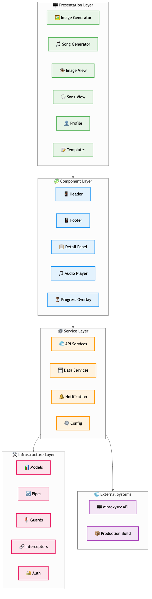

# ARC42 Architektur Dokumentation - Mac KI Service

## Inhaltsverzeichnis

1. [Einführung und Ziele](#1-einführung-und-ziele)
   - [1.1 Aufgabenstellung](#11-aufgabenstellung)
   - [1.2 Qualitätsziele](#12-qualitätsziele)
   - [1.3 Stakeholder](#13-stakeholder)
2. [Randbedingungen](#2-randbedingungen)
   - [2.1 Technische Randbedingungen](#21-technische-randbedingungen)
   - [2.2 Organisatorische Randbedingungen](#22-organisatorische-randbedingungen)
3. [Kontextabgrenzung](#3-kontextabgrenzung)
   - [3.1 Fachlicher Kontext](#31-fachlicher-kontext)
   - [3.2 Technischer Kontext](#32-technischer-kontext)
4. [Lösungsstrategie](#4-lösungsstrategie)
   - [4.1 Architekturansatz](#41-architekturansatz)
   - [4.2 Technologie-Stack](#42-technologie-stack)
5. [Bausteinsicht](#5-bausteinsicht)
   - [5.1 Systemübersicht](#51-systemübersicht)
   - [5.2 Komponenten-Details](#52-komponenten-details)
6. [Laufzeitsicht](#6-laufzeitsicht)
   - [6.1 Bildgenerierung (Synchron)](#61-bildgenerierung-synchron)
   - [6.2 Musikgenerierung (Asynchron)](#62-musikgenerierung-asynchron)
7. [Verteilungssicht](#7-verteilungssicht)
   - [7.1 Entwicklungsumgebung](#71-entwicklungsumgebung)
   - [7.2 Produktionsumgebung](#72-produktionsumgebung)
   - [7.3 Netzwerk-Architektur](#73-netzwerk-architektur)
8. [API Dokumentation](#8-api-dokumentation)
9. [Deployment-Grafik](#9-deployment-grafik)
   - [9.1 Entwicklungs-Deployment](#91-entwicklungs-deployment)
   - [9.2 Produktions-Deployment](#92-produktions-deployment)
   - [9.3 Container-Orchestrierung](#93-container-orchestrierung)
10. [Wichtigste Prozesse](#10-wichtigste-prozesse)
    - [10.1 Song-Generierung Workflow](#101-song-generierung-workflow)
    - [10.2 Error Handling & Retry Logic](#102-error-handling--retry-logic)
    - [10.3 Health Check Prozess](#103-health-check-prozess)
    - [10.4 Backup & Recovery Prozess](#104-backup--recovery-prozess)
11. [Qualitätsanforderungen](#11-qualitätsanforderungen)
    - [11.1 Performance](#111-performance)
    - [11.2 Security](#112-security)
    - [11.3 Monitoring](#113-monitoring)
12. [Glossar](#12-glossar)
13. [Datenbank-Schema](#13-datenbank-schema)
    - [13.1 Entity-Relationship-Diagramm](#131-entity-relationship-diagramm)
    - [13.2 Tabellen-Übersicht](#132-tabellen-übersicht)
    - [13.3 Beziehungen und Constraints](#133-beziehungen-und-constraints)
    - [13.4 Migration und Wartung](#134-migration-und-wartung)

## Abbildungsverzeichnis

- [Abbildung 3.1: Fachlicher Kontext](#31-fachlicher-kontext) - `images/3.1_fachlicher_kontext.png`
- [Abbildung 5.1: Systemübersicht](#51-systemübersicht) - `images/5.1_systemuebersicht.png`
- [Abbildung 5.2.1: Angular Projektstruktur](#521-aiwebui-frontend) - `images/5.2.1_angular_projektstruktur.png`
- [Abbildung 6.1: Bildgenerierung (Synchron)](#61-bildgenerierung-synchron) - `images/6.1_bildgenerierung.png`
- [Abbildung 6.2: Musikgenerierung (Asynchron)](#62-musikgenerierung-asynchron) - `images/6.2_musikgenerierung.png`
- [Abbildung 7.3: Netzwerk-Architektur](#73-netzwerk-architektur) - `images/7.3_netzwerk_architektur.png`
- [Abbildung 9.1: Entwicklungs-Deployment](#91-entwicklungs-deployment) - `images/9.1_entwicklungs_deployment.png`
- [Abbildung 9.2: Produktions-Deployment](#92-produktions-deployment) - `images/9.2_produktions_deployment.png`
- [Abbildung 10.1: Song-Generierung Workflow](#101-song-generierung-workflow) - `images/10.1_song_generierung_workflow.png`
- [Abbildung 10.2: Error Handling & Retry Logic](#102-error-handling--retry-logic) - `images/10.2_error_handling.png`
- [Abbildung 10.3: Health Check Prozess](#103-health-check-prozess) - `images/10.3_health_check.png`
- [Abbildung 10.4: Backup & Recovery Prozess](#104-backup--recovery-prozess) - `images/10.4_backup_recovery.png`
- [Abbildung 13.1: Datenbank Schema](#131-entity-relationship-diagramm) - `images/13_database_schema.png`

---

## 1. Einführung und Ziele

### 1.1 Aufgabenstellung
Das Mac KI-Service System ist eine persönliche KI-basierte Multimedia-Generierungsplattform, die folgende Hauptfunktionen bietet:
- **Bildgenerierung** via DALL-E 3 (OpenAI API)
- **Musikgenerierung** via Mureka API
- **Asynchrone Verarbeitung** für zeitaufwendige Generierungsprozesse
- **Web-basierte Benutzeroberfläche** für einfache Bedienung

### 1.2 Qualitätsziele
| Priorität | Qualitätsziel      | Motivation                                              |
| --------- | ------------------ | ------------------------------------------------------- |
| 1         | **Verfügbarkeit**  | System muss 24/7 verfügbar sein für persönliche Nutzung |
| 2         | **Performance**    | Schnelle Response-Zeiten für API-Aufrufe                |
| 3         | **Skalierbarkeit** | Erweiterung um weitere KI-Services möglich              |
| 4         | **Wartbarkeit**    | Einfache Deployment und Updates                         |

### 1.3 Stakeholder
- **Rob (Entwickler/Nutzer)**: Einziger Nutzer und Entwickler des Systems

---

## 2. Randbedingungen

### 2.1 Technische Randbedingungen
- **Hardware**: Apple Silicon (M1 Max, M4) Architektur
- **Betriebssystem**: macOS
- **Containerisierung**: Docker (via colima)
- **Python Version**: Python 3 mit miniconda3
- **Entwicklungsumgebung**: PyCharm Pro (ARM64)

### 2.2 Organisatorische Randbedingungen
- Persönliches Projekt (keine Team-Entwicklung)
- Entwicklungs- und Produktionsumgebung getrennt
- .env-Dateien nicht in Git (API-Keys, Passwörter)

---

## 3. Kontextabgrenzung

### 3.1 Fachlicher Kontext


*Abbildung 3.1: Fachlicher Kontext - Überblick über die wichtigsten Akteure und Systeme*

### 3.2 Technischer Kontext

**Externe Schnittstellen:**
- **OpenAI API**: DALL-E 3 für Bildgenerierung (HTTPS/REST)
- **Mureka API**: Musikgenerierung (HTTPS/REST)
- **AI Test Mock**: Mock-Server für Development/Testing (HTTP/REST) - Kostensenkung

**Interne Schnittstellen:**
- **Frontend ↔ Backend**: REST API (JSON über HTTPS)
- **Backend ↔ Database**: PostgreSQL (SQL)
- **Backend ↔ Cache**: Redis (Key-Value)

---

## 4. Lösungsstrategie

### 4.1 Architekturansatz
- **Microservice-orientiert**: Getrennte Services für verschiedene Funktionen
- **Event-driven**: Asynchrone Verarbeitung via Celery
- **API-First**: REST API als zentrale Schnittstelle
- **Containerisiert**: Docker für konsistente Deployments

### 4.2 Technologie-Stack
- **Frontend**: Angular 18.2.13 + TypeScript + Angular Material + SCSS
- **Backend**: Python Flask + SQLAlchemy + Alembic
- **Async Processing**: Celery + Redis
- **Database**: PostgreSQL 15
- **Proxy**: Nginx (Produktion)
- **Container**: Docker + Docker Compose

---

## 5. Bausteinsicht

### 5.1 Systemübersicht


*Abbildung 5.1: Systemübersicht - Architektonische Schichten und Komponenten*

### 5.2 Komponenten-Details

#### 5.2.1 aiwebui (Frontend)



*Abbildung 5.2.1: Angular Projektstruktur - Komponenten, Services und Module des Frontend*

- **Technologie**: Angular 18 + TypeScript + SCSS
- **Komponenten**:
  - `image-generator`: UI für Bildgenerierung
  - `image-view`: Anzeige generierter Bilder
  - `song-generator`: UI für Musikgenerierung
  - `song-view`: Anzeige generierter Songs
  - `song-profil`: Mureka Account-Informationen
  - `settings`: Systemkonfiguration und Einstellungen
  - `prompt-templates`: Template-Management für Prompts
- **Services**: API-Integration, Konfiguration, Prompt-Management, Notifications
- **Shared Components**: Header, Footer, Detail-Panels, Audio-Player, Progress-Overlay
- **Build**: `npm run build:prod` → Deployment nach `forwardproxy/html`

#### 5.2.2 aiproxysrv (Backend API)
- **Technologie**: Python Flask + SQLAlchemy
- **Struktur**:
  ```
  src/
  ├── api/           # Controllers & Routes
  │   ├── app.py     # Flask App Factory
  │   ├── image_routes.py    # Bildgenerierung API
  │   ├── song_routes.py     # Musikgenerierung API
  │   ├── chat_routes.py     # Chat API
  │   ├── prompt_routes.py   # Prompt Templates API
  │   └── redis_routes.py    # Redis Management API
  ├── db/            # Models & Database
  ├── celery_app/    # Async Processing
  ├── config/        # Konfiguration
  ├── mureka/        # Mureka Integration
  └── alembic/       # DB Migrations
  ```

#### 5.2.3 aitestmock (Test Mock Server)
- **Technologie**: Python Flask
- **Zweck**: Mock-Server für OpenAI und Mureka APIs zur Kostensenkung in Entwicklung/Testing
- **Struktur**:
  ```
  src/           # Source Code
  data/          # JSON Response Templates
  static/        # Mock Images, Audio Files (FLAC/MP3/ZIP)
  ```
- **Test-Szenarien**:
  - **Bildgenerierung**: Prompt mit "0001" → Success, "0002" → Invalid Token Error
  - **Song-Generierung**: Lyrics mit "0001" → Success, "0002" → Invalid Token, "0003" → Generation Failed
  - **Timing**: Style-Prompt "30s" → 30 Sekunden Sync Duration

#### 5.2.4 forwardproxy (Nginx)
- **Technologie**: Nginx 1.23.3
- **Funktionen**:
  - HTTPS Terminierung (TLS 1.3)
  - Rate Limiting (5req/s)
  - Static File Serving
  - API Proxy zu aiproxysrv:5050

---

## 6. Laufzeitsicht

### 6.1 Bildgenerierung (Synchron)


*Abbildung 6.1: Bildgenerierung (Synchron) - Sequenzdiagramm des Bildgenerierungsprozesses*

### 6.2 Musikgenerierung (Asynchron)


*Abbildung 6.2: Musikgenerierung (Asynchron) - Sequenzdiagramm des asynchronen Musikgenerierungsprozesses*

---

## 7. Verteilungssicht

### 7.1 Entwicklungsumgebung
```
MacBook Air M4 (32GB RAM)
├── Host macOS
├── PyCharm Pro (ARM64)
├── Python miniconda3 (mac_ki_service env)
├── Docker colima
│   └── PostgreSQL Container (Port 5432)
├── Local Services
│   ├── Flask Dev Server (server.py)
│   ├── Celery Worker (worker.py)
│   ├── Angular Dev Server (ng serve)
│   └── AI Test Mock Server (aitestmock) - Optional für Kostensenkung
└── Configuration
    └── .env Dateien mit Mock-API URLs statt echter OpenAI/Mureka APIs
```

### 7.2 Produktionsumgebung
```
Mac Studio M1 Max (32GB RAM) - IP: 10.0.1.120
├── Host macOS
├── Docker colima
│   ├── webui-network (Bridge)
│   ├── PostgreSQL (Container: postgres)
│   ├── Redis (Container: redis)
│   ├── Celery Worker (Container: celery-worker)
│   ├── API Server (Container: aiproxysrv)
│   └── Nginx Proxy (Container: forward-proxy)
├── Native Services
│   ├── Ollama (Port 11434)
│   └── Open WebUI
└── Storage
    ├── postgres-data (Volume)
    ├── redis-data (Volume)
    └── images-data (Volume)
```

### 7.3 Netzwerk-Architektur


*Abbildung 7.3: Netzwerk-Architektur - Produktionsumgebung mit Docker-Netzwerk und Host-Services*

---

## 8. API Dokumentation

Die vollständige API-Dokumentation ist automatisch generiert und immer aktuell verfügbar:

- **Swagger UI**: `http://localhost:5050/api/docs/` (interaktive Dokumentation)
- **OpenAPI JSON**: `http://localhost:5050/api/openapi.json`
- **OpenAPI YAML**: `http://localhost:5050/api/openapi.yaml`

Die Dokumentation wird automatisch aus dem Python-Code generiert (Code-First Ansatz) und ist daher immer synchron mit der Implementierung.

---

## 9. Deployment-Grafik

### 9.1 Entwicklungs-Deployment


*Abbildung 9.1: Entwicklungs-Deployment - Lokale Entwicklungsumgebung mit Mock-Services*

### 9.2 Produktions-Deployment


*Abbildung 9.2: Produktions-Deployment - Vollständige Docker-basierte Produktionsumgebung*

### 9.3 Container-Orchestrierung

```yaml
# Vereinfachte docker-compose.yml Struktur
services:
  postgres:
    image: postgres:15-alpine
    ports: ["5432:5432"]
    volumes: [postgres-data:/var/lib/postgresql/data]
    healthcheck: pg_isready

  redis:
    image: redis:alpine  
    ports: ["6379:6379"]
    volumes: [redis-data:/data]
    healthcheck: redis-cli ping

  celery-worker:
    build: .
    command: celery worker
    depends_on: [postgres, redis]
    volumes: [.:/app]

  aiproxy-app:
    build: .
    ports: ["5050:5050"] 
    depends_on: [postgres, celery-worker]
    volumes: [.:/app, images-data:/images]

  nginx:
    image: nginx:1.23.3
    ports: ["80:80", "443:443"]
    volumes: [./nginx/nginx.conf:/etc/nginx/nginx.conf]
```

---

## 10. Wichtigste Prozesse

### 10.1 Song-Generierung Workflow


*Abbildung 10.1: Song-Generierung Workflow - Zustandsdiagramm des kompletten Song-Generierungsprozesses*

### 10.2 Error Handling & Retry Logic


*Abbildung 10.2: Error Handling & Retry Logic - Flussdiagramm der Fehlerbehandlung und Retry-Mechanismen*

### 10.3 Health Check Prozess


*Abbildung 10.3: Health Check Prozess - Überwachung und Monitoring aller Services*

### 10.4 Backup & Recovery Prozess


*Abbildung 10.4: Backup & Recovery Prozess - Sicherung und Wiederherstellung der Daten*

---

## 11. Qualitätsanforderungen

### 11.1 Performance
- **API Response Time**: < 200ms für Standard-Requests
- **Image Generation**: < 30s für DALL-E 3 Calls
- **Song Generation**: 2-5 Minuten (abhängig von Mureka)
- **Concurrent Users**: 1 (persönliche Nutzung)

### 11.2 Security
- **HTTPS**: TLS 1.3 Verschlüsselung
- **Rate Limiting**: 5 req/s via Nginx
- **API Keys**: Secure Storage in .env files
- **CORS**: Konfiguriert für Frontend-Domain

### 11.3 Monitoring
- **Health Checks**: Alle Services alle 30s
- **Logging**: Strukturierte Logs via Python logging
- **Alerts**: Container-Restart bei Health Check Failures

---

## 12. Glossar

| Begriff        | Definition                                                                      |
| -------------- | ------------------------------------------------------------------------------- |
| **DALL-E 3**   | OpenAI's Bildgenerierungs-KI                                                    |
| **Mureka**     | Song-Generierungs-API Service                                                   |
| **Celery**     | Python Task Queue für asynchrone Verarbeitung                                   |
| **Colima**     | Container Runtime für macOS (Docker Alternative)                                |
| **Alembic**    | Database Migration Tool für SQLAlchemy                                          |
| **Task ID**    | Celery Task Identifier für Async Operations                                     |
| **Job ID**     | Mureka Job Identifier für Song Generation                                       |
| **Choice**     | Einzelne Musikvariante von Mureka (meist 2 pro Generation)                      |
| **Ollama**     | Open-Source LLM Runtime für lokale Chat-Generierung (10.0.1.120:11434)         |
| **Chat API**   | Ollama-basierte Text-Generierung für Conversational AI mit 4 Endpunkten         |
| **AI Magic Functions** | Template-basierte intelligente Prompt-Erweiterung via prompt_templates   |
| **Prompt Templates** | Wiederverwendbare Prompt-Vorlagen mit pre/post conditions und AI-Parametern |
| **Template Processing** | Automatische Prompt-Optimierung mit model, temperature, max_tokens       |
| **Settings**   | Frontend-Komponente für Systemkonfiguration und Benutzereinstellungen           |
| **Entity-Relationship** | Datenbankschema mit 4 Tabellen und definierten Beziehungen                |
| **aitestmock** | Mock-Server für OpenAI und Mureka APIs zur Kostensenkung in Development/Testing |

---

## 13. Datenbank-Schema

### 13.1 Entity-Relationship-Diagramm


*Abbildung 13.1: Datenbank Schema - Entity-Relationship-Diagramm aller Tabellen und Beziehungen*

### 13.2 Tabellen-Übersicht

#### 13.2.1 songs
**Zweck**: Haupttabelle für Song-Generierung und -Verwaltung

| Spalte | Typ | Beschreibung |
|--------|-----|-------------|
| `id` | UUID | Primary Key |
| `task_id` | VARCHAR(255) | Celery Task ID (unique) |
| `job_id` | VARCHAR(255) | MUREKA Job ID |
| `lyrics` | TEXT | Song-Text Input |
| `prompt` | TEXT | Style-Prompt für Generierung |
| `model` | VARCHAR(100) | Generierungsmodell (default: "chirp-v3-5") |
| `title` | VARCHAR(500) | Benutzerdefinierter Titel |
| `tags` | VARCHAR(1000) | Benutzerdefinierte Tags |
| `workflow` | VARCHAR(50) | Status: onWork, inUse, notUsed |
| `status` | VARCHAR(50) | PENDING, PROGRESS, SUCCESS, FAILURE, CANCELLED |
| `progress_info` | TEXT | JSON Progress-Details |
| `error_message` | TEXT | Fehlerinformationen |
| `mureka_response` | TEXT | Vollständige MUREKA Response (JSON) |
| `mureka_status` | VARCHAR(100) | MUREKA-spezifischer Status |
| `created_at` | TIMESTAMP | Erstellungszeitpunkt |
| `updated_at` | TIMESTAMP | Letzte Aktualisierung |
| `completed_at` | TIMESTAMP | Abschlusszeitpunkt |

#### 13.2.2 song_choices
**Zweck**: Einzelne Song-Varianten von MUREKA (1:N zu songs)

| Spalte | Typ | Beschreibung |
|--------|-----|-------------|
| `id` | UUID | Primary Key |
| `song_id` | UUID | Foreign Key zu songs.id |
| `mureka_choice_id` | VARCHAR(255) | MUREKA Choice Identifier |
| `choice_index` | INTEGER | Index im choices Array |
| `mp3_url` | VARCHAR(1000) | MP3 Datei URL |
| `flac_url` | VARCHAR(1000) | FLAC Datei URL |
| `video_url` | VARCHAR(1000) | Video Datei URL |
| `image_url` | VARCHAR(1000) | Cover-Bild URL |
| `duration` | FLOAT | Dauer in Millisekunden |
| `title` | VARCHAR(500) | Choice-Titel |
| `tags` | VARCHAR(1000) | Choice-Tags |
| `rating` | INTEGER | Bewertung (0=thumbs down, 1=thumbs up) |
| `created_at` | TIMESTAMP | Erstellungszeitpunkt |
| `updated_at` | TIMESTAMP | Letzte Aktualisierung |

#### 13.2.3 generated_images
**Zweck**: Generierte Bilder und Metadaten

| Spalte | Typ | Beschreibung |
|--------|-----|-------------|
| `id` | UUID | Primary Key |
| `prompt` | TEXT | Generierungs-Prompt |
| `size` | VARCHAR(20) | Bildgröße (z.B. "1024x1024") |
| `filename` | VARCHAR(255) | Eindeutiger Dateiname |
| `file_path` | VARCHAR(500) | Lokaler Dateipfad |
| `local_url` | VARCHAR(500) | Lokale Zugriffs-URL |
| `model_used` | VARCHAR(100) | Verwendetes Generierungsmodell |
| `prompt_hash` | VARCHAR(32) | Prompt-Hash für Deduplizierung |
| `title` | VARCHAR(255) | Benutzerdefinierter Titel |
| `tags` | TEXT | Benutzerdefinierte Tags |
| `created_at` | TIMESTAMP | Erstellungszeitpunkt |
| `updated_at` | TIMESTAMP | Letzte Aktualisierung |

#### 13.2.4 prompt_templates
**Zweck**: AI-Prompt Templates für verschiedene Kategorien und Aktionen

| Spalte | Typ | Beschreibung |
|--------|-----|-------------|
| `id` | INTEGER | Primary Key |
| `category` | VARCHAR(50) | Template-Kategorie (images, songs, lyrics) |
| `action` | VARCHAR(50) | Template-Aktion (generate, enhance, translate) |
| `pre_condition` | TEXT | Text vor dem Prompt |
| `post_condition` | TEXT | Text nach dem Prompt |
| `description` | TEXT | Template-Beschreibung |
| `version` | VARCHAR(10) | Template-Version |
| `model` | VARCHAR(50) | Ollama Model-Hint |
| `temperature` | FLOAT | Ollama Temperature (0.0-2.0) |
| `max_tokens` | INTEGER | Maximale Token-Anzahl |
| `active` | BOOLEAN | Template ist aktiv |
| `created_at` | TIMESTAMP | Erstellungszeitpunkt |
| `updated_at` | TIMESTAMP | Letzte Aktualisierung |

### 13.3 Beziehungen und Constraints

- **songs ↔ song_choices**: 1:N Beziehung mit CASCADE DELETE
- **Unique Constraints**: `songs.task_id`, `generated_images.filename`
- **Indexes**: Auf `task_id`, `job_id`, `song_id` für Performance
- **Foreign Keys**: `song_choices.song_id` → `songs.id`

### 13.4 Migration und Wartung

**Migration Commands:**
```bash
# Neue Migration erstellen
alembic revision --autogenerate -m "description"

# Migrationen anwenden
alembic upgrade head

# Aktuelle Version prüfen
alembic current
```

**Wichtige Überlegungen:**
- UUID als Primary Keys für bessere Skalierbarkeit
- JSON-Felder für flexible Metadaten-Speicherung
- Timestamps für Audit-Trail
- Cascade Deletes für Datenintegrität

---

*Dokument erstellt am: 01.09.2025*
*Zuletzt aktualisiert: 23.09.2025*
*Version: 1.5*
*Autor: Rob (rob.wellinger@gmail.com)*
